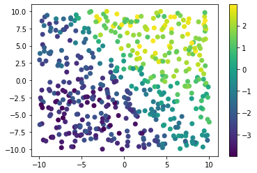
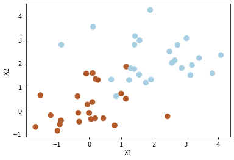
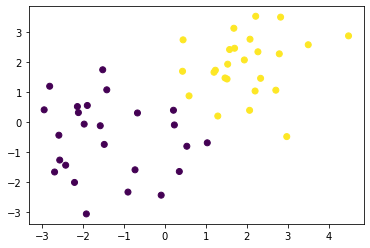
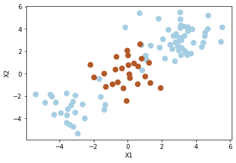

# Data sets 

These data sets are largely taken from downloads of the ISLR textbook's R package. A few of them have required some modification to make it a bit easier.  I've also included some sample data sets generated for various notebooks in the lectures. Notes on each are below. For the data sets generated by Dr. Munch, the code for generation is also included.


## Advertising 

TODO


## Auto 

TODO


## Boston 

TODO. Also DO NOT USE!


## Carseats 

TODO

## Clustering example data

### Clustering-toy-data 

Dr. Munch made these data sets for use in the example hierarchical clustering module. 


```python
np.random.seed(1)
n1 = 20
X1 = np.random.normal((0,0), .3, (n1,2))

n2 = 15
X2 = np.random.normal((4,1), .5, (n2,2))

n3 = 21
X3 = np.random.normal((1,3), .6, (n3,2))


for A in [X1,X2,X3]:
    plt.scatter(A[:,0],A[:,1])

X = np.concatenate([X1,X2,X3],axis = 0)
np.random.shuffle(X)
```
### Clustering-toy-data2 


```python
np.random.seed(1)
n1 = 20
X1 = np.random.normal((0,0), 1, (n1,2))
n1b = 20
X1b = np.random.normal((0,0), 0.5, (n1b,2))

n2 = 15
X2 = np.random.normal((4,1), .7, (n2,2))

n3 = 21
X3 = np.random.normal((1,3), .5, (n3,2))


for A in [X1,X2,X3,X1b]:
    plt.scatter(A[:,0],A[:,1])

X = np.concatenate([X1,X2,X3,X1b],axis = 0)
np.random.shuffle(X)

```

## College 

TODO


## Default 

TODO

## Deep learning examples

### DL-toy-data


Code used for some example creations in the deep learning module. Dr. Munch generated this using the following code:

```python
w = np.array([(1,2,1),(-1,0,1),(3,-1,-1)]) #<----- Original choices 
beta = np.array((-1,2,1,-2))               #<----- of matrices

np.random.seed(0)
X = np.random.random((30,2))*20-10
y = []
for i in range(30):
    y.append(MyFirstNN(X[i,0],X[i,1],w, beta))
y = np.array(y)

ynoise = y + np.random.random(30)*2-1

data = np.concatenate((X,ynoise.reshape(-1,1)),axis = 1)
```

### DL-toy-data-bigger



```python
def MyFirstNN(X1,X2,w, beta):
    
    X = np.array((X1,X2))
    A = []
    
    for i in range(3): 
        Ai = w[i,0] + np.dot(w[i,1:],X)
        Ai = 1/(1+np.exp(-Ai))
        A.append(Ai)
    
    A = np.array(A)
    
    Y = beta[0] + np.dot(beta[1:], A)

    return Y


w = np.array([(1,2,1),(-1,0,1),(3,-1,-1)]) #<----- Original choices 
beta = np.array((-1,2,1,-2))               #<----- of matrices

np.random.seed(0)
n= 500
X = np.random.random((n,2))*20-10
y = []
for i in range(n):
    y.append(MyFirstNN(X[i,0],X[i,1],w, beta))
y = np.array(y)


ynoise = y + np.random.random(n)*2-1

data = np.concatenate((X,ynoise.reshape(-1,1)),axis = 1)
```

### DL-ToyImage


An image used to try out convolutional filters in the CNN module. Data generated using the following code:

```python
np.random.seed(48824)
M = np.random.random((30,30))
M = np.round(10*M, 1)
for i in range(30):
    for j in range(30):
        if i**2 + j**2 < 15**2:
            M[i,j] -= 10

M[25:,:] -=10
M[:25,25:]-=10
```

## Hitters 

TODO

## OJ 

TODO

## Portfolio 

TODO


## Portfolio2 

TODO

## SVM Examples

Synthetic data generated by Dr. Munch for the SVM labs. 

### SVM-Data




```python
# Generating random data: 20 observations of 2 features and divide into two classes.

np.random.seed(5)
n = 50
X = np.random.randn(n,2)
y = np.repeat([1,-1], n/2) # 
X[y == -1] = X[y == -1]+2

data = np.concatenate((X,y.reshape(-1,1)), axis = 1)
np.random.shuffle(data)
```


### SVM-Data2



```python
# Generating random data: 50 observations of 2 features and divide into two classes.
# This one is more spread about than original
np.random.seed(48824)
n = 50
X = np.random.randn(n,2)
y = np.repeat([1,-1], n/2) # 
X[y == -1] = X[y == -1]+2
X[y == 1] = X[y == 1]-1.5
X[:,1][y == 1] = X[:,1][y == 1]+.9
y = y*-1


data = np.concatenate((X,y.reshape(-1,1)), axis = 1)
np.random.shuffle(data)
```


### SVM-Data3

Generated to emphasize usefulness of kernel options in SVM.



```python
np.random.seed(8)
n = 100
k = int(n/4)
X = np.random.randn(n,2)
X[:2*k] = X[:2*k] +3
X[2*k+1:3*k] = X[2*k+1:3*k] -3
y = np.concatenate([np.repeat(-1, 3*k), np.repeat(1,n-3*k)])
data = np.concatenate((X,y.reshape(-1,1)), axis = 1)
```


## Wage 

TODO


